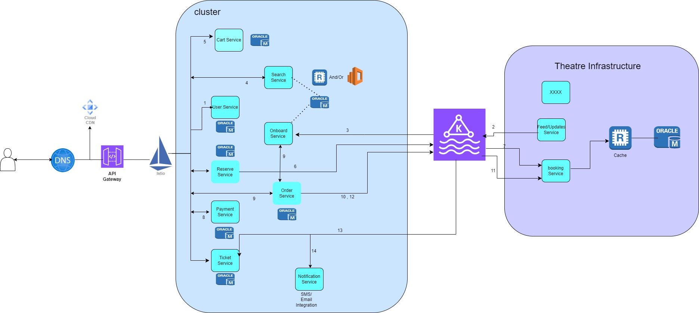
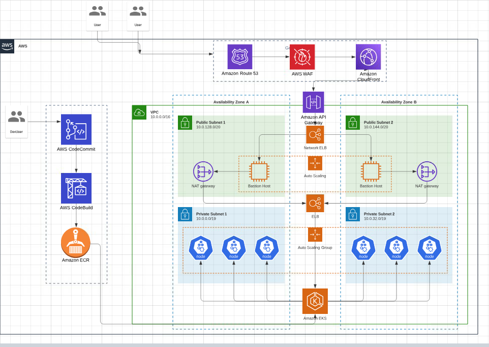

## High Level Design

## AWS INFRA

## running the docker and bringing kafka cluster up
1) got to D:\microservices-projects\DatabaseService
2) if you are on wiondows , ensure docker desktop is running
3) Run docker-compose up -d from command prompt

## 4 topics created 
docker exec -it databaseservice-kafka-1 kafka-topics.sh --create --topic city --partitions 1 --replication-factor 1 --bootstrap-server localhost:9092

docker exec -it databaseservice-kafka-1 kafka-topics.sh --create --topic movie --partitions 1 --replication-factor 1 --bootstrap-server localhost:9092

docker exec -it databaseservice-kafka-1 kafka-topics.sh --create --topic city_theatre --partitions 1 --replication-factor 1 --bootstrap-server localhost:9092

docker exec -it databaseservice-kafka-1 kafka-topics.sh --create --topic show --partitions 1 --replication-factor 1 --bootstrap-server localhost:9092

2. Produce Messages to the Topic:
   docker exec -it databaseservice-kafka-1 kafka-console-producer.sh --topic my-topic --bootstrap-server localhost:9092

3. Consume Messages from the Topic:
   docker exec -it databaseservice-kafka-1 kafka-console-consumer.sh --topic my-topic --from-beginning --bootstrap-server localhost:9092
2. Produce Messages to the Topic:
   docker exec -it databaseservice-kafka-1 kafka-console-producer.sh --topic my-topic --bootstrap-server localhost:9092

3. Consume Messages from the Topic:
   docker exec -it databaseservice-kafka-1 kafka-console-consumer.sh --topic my-topic --from-beginning --bootstrap-server localhost:9092

4. Check Kafka Server Logs:
   tail -n 100 <kafka_installation_directory>/logs/server.log | grep -i "Kafka Server started"

## h2 console
1) http://localhost:8010/h2-console/ is the url , h2 database in TCP mode after running DatabaseService Application   
2) url : jdbc:h2:file:D:/data/demo
3) username as "sa" and password as empty

6. to stop all running docker images
   docker rmi -f $(docker images -q)

docker ps -q       // list all running container
docker stop <image_id>

for /f "delims=" %i in ('docker images -q') do docker rmi -f %i                 // remove all docker images
for /f "delims=" %i in ('docker ps -q') do docker stop %i                     // stopping all containers

## services
1) **database Service** : will run the h2 DB in TCP mode
2) **RemoteTheatreService** : Main Theatre application exposing rest endpoint at http://localhost:8011/swagger-ui acting as B2B business controller
3) **OnboardService** : acting as B2CBusiness responsible for updating city,theatre and shows from RemoteTheatreService using messagingSystem as integration
4) **SearchService** : for browsing all the content on UI

## Monetize  Platform

1) Offers during the payment will increase customer base and service charges applied will increase based on tickets booked.
2) Advertisements over the platform can help in revenue.
3) Offers in snacks booking along with Ticket can help again by taking commission from Theater vendors.

## Scaling  Platform

1) Autoscaling enabled for pods to handle peak requests
2) Multiple Web Servers load balanced
3) Master Slave RDMS in different availability Zones . Read Replicas maintained for faster response
4) Redis Caching to hold the DB information for cities/theater/shows to reduce backend traffic to DB
5) Aysnc  process rest calls to Theater API’s
6) DR can be placed in other region for Disaster recovery
7) CDN and Webserver caching for static content e.g videos, trailers, images

## Release management  Across Cities

1) Separate Config project for various environments and various regions and controlled by Spring profiles
2) I18 internalization applied for Messages for various languages supported on UI
3) Code Pipelines with actions , to deploy to various regions
4) CDN for static content
5) Canary Deployment/Blue Green Deployment Methodology can be used to keep 99.99% availability during the releases

## Monitoring

1) Cloud Watch Events in AWS generated for servers . Using Alarms,Alerts and CloudTrail , can help in additional monitoring
2) Prometheus and Grafana can helping in configuring alerts and log aggregation.
3) AWS distributed tracing Xray can be integrated , can leverage Service Mesh monitoring as well